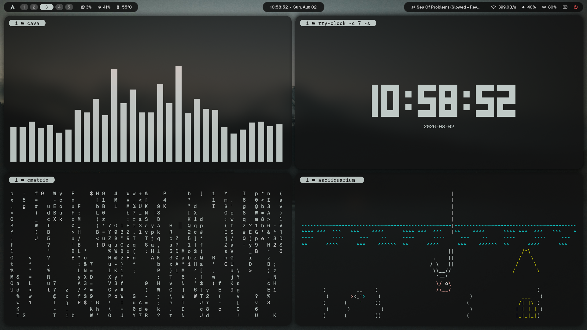
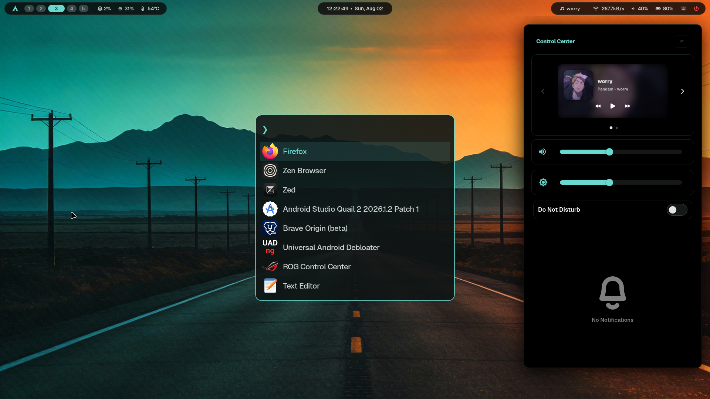
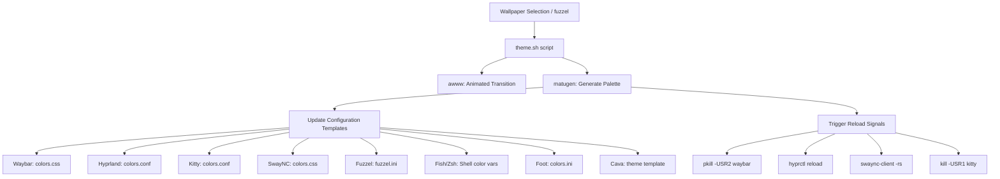

# Hyprland Dotfiles

A customized, Wayland-centric desktop environment built on Arch Linux. Features dynamic wallpaper-based color generation, a Wayland utility suite, and an optimized terminal environment using Zsh and Fish.

---

## Previews

### Desktop


### Theme & Components


---

## Features

*   **Dynamic Theming**: Color schemes generated automatically from your wallpaper via Matugen.
*   **Lua Configuration**: Declarative window manager configuration using Hyprland's native Lua syntax (v0.55+).
*   **Wallpaper Transitions**: Smooth transitions powered by `awww`.
*   **Dual Shells**: Synchronized aliases and abbreviations in Zsh and Fish.
*   **Wayland Suite**: Integrated Waybar status bar, SwayNC notification drawer, and Fuzzel launcher.
*   **Utility Bindings**: Quick shortcuts for task management, clipboards, screenshots, and system controls.

---

## Theme Pipeline

Flow showing how wallpaper selection propagates colors and reloads active components:


```mermaid
graph TD
    A[Wallpaper Selection / fuzzel] --> B[theme.sh script]
    B --> C[awww: Animated Transition]
    B --> D[matugen: Generate Palette]
    D --> E[Update Configuration Templates]
    D --> F[Trigger Reload Signals]
    
    E --> E1[Waybar: colors.css]
    E --> E2[Hyprland: colors.conf]
    E --> E3[Kitty: colors.conf]
    E --> E4[SwayNC: colors.css]
    E --> E5[Fuzzel: fuzzel.ini]
    E --> E6[Fish/Zsh: Shell color vars]
    E --> E7[Foot: colors.ini]
    E --> E8[Cava: theme template]
    
    F --> F1[pkill -USR2 waybar]
    F --> F2[hyprctl reload]
    F --> F3[swaync-client -rs]
    F --> F4[kill -USR1 kitty]
```

---

## Components

| Component | Software | Directory / Config | Description |
| :--- | :--- | :--- | :--- |
| **Window Manager** | Hyprland | [hypr/](file:///home/masum/hyprland/hypr) | Lua layouts, gestures, rules, and keybinds. |
| **Status Bar** | Waybar | [waybar/](file:///home/masum/hyprland/waybar) | Modular status bar styled via Matugen. |
| **Application Launcher** | Fuzzel | [fuzzel/](file:///home/masum/hyprland/fuzzel) | Fast, minimal Wayland-native launcher. |
| **Notifications** | SwayNC | [swaync/](file:///home/masum/hyprland/swaync) | Custom notification center daemon. |
| **Theming Engine** | Matugen | [matugen/](file:///home/masum/hyprland/matugen) | Wallpaper color scheme generator and template parser. |
| **Terminals** | Kitty & Foot | [kitty/](file:///home/masum/hyprland/kitty), [foot/](file:///home/masum/hyprland/foot) | High-performance, GPU-accelerated terminal emulators. |
| **Shells** | Zsh & Fish | [.zshrc](file:///home/masum/hyprland/.zshrc), [fish/](file:///home/masum/hyprland/fish) | Configured with auto-suggestions and synchronized aliases. |
| **Shell Prompt** | Starship | [starship.toml](file:///home/masum/hyprland/starship.toml) | Modern, cross-shell prompt theme. |
| **File Manager** | Nautilus & Yazi | System Packages | Graphical file manager (Nautilus) and terminal file manager (Yazi). |
| **Lock Screen** | Hyprlock | [hyprlock.conf](file:///home/masum/hyprland/hypr/hyprlock.conf) | Fast, secure session locker. |
| **Visualizer** | Cava | [cava/](file:///home/masum/hyprland/cava) | Audio spectrum visualizer. |

---

## Keybinds

### Applications

| Keybind | Action | Description |
| :--- | :--- | :--- |
| `SUPER + T` | Terminal | Launch Kitty |
| `SUPER + SHIFT + T` | Terminal (fallback) | Launch Foot |
| `SUPER + D` | Application Menu | Open Fuzzel app launcher |
| `SUPER + G` | File Search | Run interactive file search |
| `SUPER + B` | Brave Browser | Open Brave |
| `SUPER + SHIFT + B` | Brave Browser (safe) | Open Brave with GPU compositing disabled |
| `SUPER + E` | File Manager | Open Nautilus |
| `SUPER + SHIFT + E` | Terminal File Manager | Open Yazi in Kitty |
| `SUPER + C` | Calculator | Open GNOME Calculator |
| `SUPER + R` | Drawing/Notes | Launch Rnote canvas |

### Utilities

| Keybind | Action | Description |
| :--- | :--- | :--- |
| `SUPER + Q` | Close Window | Close focused window |
| `SUPER + SPACE` | Float Toggle | Toggle floating mode for active window |
| `SUPER + F` | Fullscreen | Toggle fullscreen mode |
| `SUPER + V` | Clipboard History | Open cliphist history in Fuzzel |
| `SUPER + X` | Task Killer | Process killer menu (`kill_task.sh`) |
| `SUPER + P` | Project Launcher | Select workspace project (`project_launcher.sh`) |
| `SUPER + K` | Virtual Keyboard | Toggle accessibility keyboard |
| `SUPER + period` | Emoji Selector | Open Bemoji picker |
| `SUPER + N` | Notification Center | Toggle SwayNC drawer |
| `SUPER + H` | Toggle Status Bar | Show or hide Waybar |
| `SUPER + S` | System Menu | Open system actions menu via Fuzzel |
| `SUPER + W` | Wallpaper Selector | Open wallpaper picker |
| `SUPER + SHIFT + W` | Random Wallpaper | Apply a random wallpaper from `~/wallpapers/` |
| `SUPER + Y` | Color Picker | Copy hex value from hyprpicker |

### System & Media

| Keybind | Action | Description |
| :--- | :--- | :--- |
| `PRINT` | Screenshot (Full) | Capture screen to screenshots directory |
| `SHIFT + PRINT` | Screenshot (Region) | Crop screen capture and edit with Satty |
| `XF86AudioRaiseVolume` | Volume Up | Increase audio sink volume |
| `XF86AudioLowerVolume` | Volume Down | Decrease audio sink volume |
| `XF86MonBrightnessUp` | Brightness Up | Increase display brightness |
| `XF86MonBrightnessDown` | Brightness Down | Decrease display brightness |
| `SUPER + L` | Lock Screen | Lock session and turn off screen |
| `Pause` | Display Sleep | Turn off display (DPMS Off) |
| `SUPER + Escape` | Power Menu | Open logout/shutdown menu |

### Terminal & Zsh

| Shortcut | Action | Description |
| :--- | :--- | :--- |
| `z <query>` | Zoxide Jump | Smart directory navigation |
| `Ctrl + F` | Zoxide Menu | Interactive directory jumper |
| `Alt + C` | Fuzzy Directory | Fzf directory search with eza tree preview |
| `Ctrl + P` | Fuzzy File Path | Fzf file search that pastes the path to terminal |
| `Ctrl + O` | Fuzzy Edit (`fe`) | Find file and immediately open in Vim |
| `Ctrl + R` | Fuzzy History | Search command history with syntax highlighted previews |
| `yy` | Yazi Wrapper | Launch Yazi and sync working directory upon exit |
| `Ctrl + Delete` | Word Delete | Delete word forward (works inside fzf too) |
| `Ctrl + Alt + T` | Nautilus Terminal | Spawns Kitty inside the current Nautilus folder |

---

## Installation

### Prerequisites

*   A clean installation of **Arch Linux**.
*   Active internet connection.

### Setup

```bash
# Clone the repository
git clone https://github.com/insaneodyssey26/hyprland.git ~/hyprland

# Run setup
cd ~/hyprland
chmod +x setup.sh
./setup.sh
```

The script will:
1. Validate dependencies and Arch environments.
2. Install base utilities and `paru` if missing.
3. Install required pacman and AUR packages.
4. Symlink directory configurations to `~/.config/`.
5. Configure `fish` as the default shell.
6. Initialize the color scheme using the default wallpaper.

After installation, start the session:
```bash
Hyprland
```

---

## Personalization Guide (Things you MUST change)

Because these dotfiles are highly optimized for my specific workflow and hardware, there are a few hardcoded elements you must update for your own system:

### 1. Dual-Boot Hard Drive Paths
My `file_search.sh` and `project_launcher.sh` scripts scan specific Windows partition mounts. If you don't have a dual-boot setup, or your mounts are named differently, these will fail to find anything.
* **Fix**: Open `~/.config/hypr/scripts/project_launcher.sh` and `~/.config/hypr/scripts/file_search.sh` and change the `DIR1`/`DIR2` and `search_paths` variables to point to your actual project and file directories.

### 2. Lockscreen Battery Monitor
My `hyprlock.conf` manually pulls the battery percentage from `/sys/class/power_supply/BAT1/capacity`. Many laptops map their battery to `BAT0`. If your battery percentage is blank on the lockscreen, this is why.
* **Fix**: Open `~/.config/hypr/hyprlock.conf` and change `BAT1` to `BAT0`.

### 3. Lockscreen Name
The lockscreen greeting is hardcoded to display my name ("Masum").
* **Fix**: Open `~/.config/hypr/hyprlock.conf`, search for `text = Masum` under the User Name group, and change it to `$USER` or your own name.

### 4. Waybar Hardware Sensors
My Waybar configuration (`config.jsonc`) has several hardware-specific hardcodes:
* **CPU Temp**: It uses a direct PCI hardware path (`/sys/devices/pci0000:00/0000:00:18.3/hwmon`) to fetch temps. This will break on other motherboards.
* **Battery**: It expects the battery to be `BAT1` and clicking the battery icon attempts to open `rog-control-center` (an ASUS specific app).
* **Fix**: Open `~/.config/waybar/config.jsonc`. Under the `temperature` module, delete the `hwmon-path-abs` line entirely so Waybar auto-detects it. Under `battery`, change `BAT1` to `BAT0` and change the `on-click` to your own power manager.

### 5. Monitor Configuration
My monitor configuration explicitly hardcodes my laptop screen (`eDP-1`) to run at 144Hz.
* **Fix**: Open `~/.config/hypr/configs/monitors.lua` and change `eDP-1` to your monitor's name (run `hyprctl monitors` to find it), or just use `,preferred,auto,auto` to make it universal.
